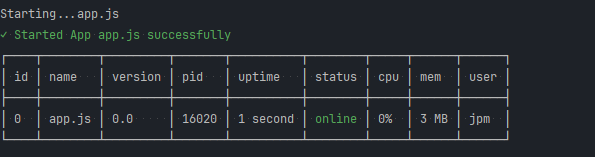
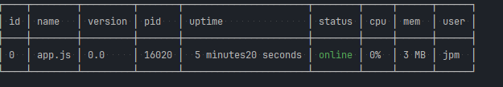

# Java Process Manager (JPM)

Version: 0.1

Welcome and thank you for using

JPM is a application process manager for  apps for Linux and Windows Operating Systems.This helps or facilitates your applications to run in the background and report and errors and crushes.
This is helps with just application administration , we aim to keep the administration very simple

Supported applications Environments:
- Java Jar apps
- Node JS apps

More support is comming for other apps .


#### What's Required?
Just make sure Java and NodeJs is install globally on the system .

For development use graalvm-java sdk-22 and above

#### How to install?
just download the jpm app or binary app found in the [executable-app](/executable-app) folder in this repository.

Make jpm as part of the global `PATH` or add the folder where jpm file is found to `PATH`

Please note the first install of running `jpm install` run as adminstrator . 

Start or run an Application as a process
```shell
jpm start app.js 
```
or
```shell
jpm start app.jar
```
[Screenshot](imgs/1.png)




you can call `jpm` from anywhere on the machine or folder it will work given its defined on the PATH 

To get list of running apps/process that jpm is managing :

```shell
jpm ls
```
To stop application :
```shell
jpm stop <app_name|id|'all'>
```
[Screenshot](imgs/2.png)




This will remove the app from the list of apps.

How the app works as much.

The jpm app does not run the application directly it makes use of a baeck service application that maintains them .
When or after running `jmp install` successfully this will install the server that runs on port 8080 .

Both apps are binary apps . The server will alwasys be running 


Built with the following for windows:

```shell
Java version: 22+36, vendor version: GraalVM CE 22+36.1
Graal compiler: optimization level: 2, target machine: x86-64-v3
C compiler: cl.exe (microsoft, x64, 19.39.33523)
Garbage collector: Serial GC
```
This app is still in development as this is still being explore if its a viable product to push.

Contributions are welcome.

